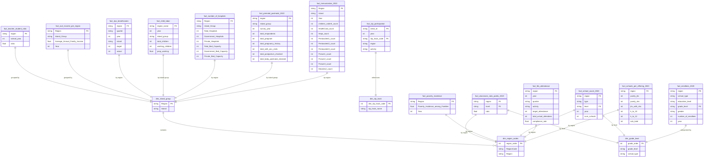

```mermaid
erDiagram
    dim_island_group ||--o{ dim_region_codes : contains
    dim_island_group {
        string Region PK
        string Island
    }
    
    dim_region_codes {
        int region_order PK
        string RegionCode
        string Region
    }
    
    dim_slp_track {
        int dim_slp_track_code PK
        string slp_track_name
    }
    
    dim_grade_level {
        int grade_order PK
        string grade_level
        string school_type
    }
    
    fact_teacher_student_ratio ||--|| dim_island_group : "grouped by"
    fact_teacher_student_ratio {
        string region FK
        int school_year
        float ratio
    }
    
    fact_ave_income_per_region ||--|| dim_island_group : "grouped by"
    fact_ave_income_per_region {
        string Region FK
        string Island_Group
        float Average_Annual_Family_Income
        int Year
    }
    
    fact_classroom_ratio_public_2019 ||--|| dim_region_codes : "by region"
    fact_classroom_ratio_public_2019 ||--|| dim_grade_level : "by level"
    fact_classroom_ratio_public_2019 {
        string region FK
        string level FK
        float ratio
    }
    
    fact_poverty_incidence ||--|| dim_region_codes : "by region"
    fact_poverty_incidence {
        string Region FK
        float Poverty_Incidence_among_Families
        int Year
    }
    
    fact_school_count_2020 ||--|| dim_region_codes : "by region"
    fact_school_count_2020 ||--|| dim_grade_level : "by level"
    fact_school_count_2020 {
        string region FK
        string type
        string level FK
        int year
        int num_schools
    }
    
    fact_slp_participation ||--|| dim_slp_track : references
    fact_slp_participation {
        string rdmd_id PK
        int year
        string slp_track_code FK
        string region
        string activity
    }
    
    fact_4ps_beneficiaries ||--|| dim_island_group : "by region"
    fact_4ps_beneficiaries {
        string region FK
        string quarter
        int year
        string island
        int target
        int actual
    }
    
    fact_child_labor ||--|| dim_island_group : "by island group"
    fact_child_labor {
        string region_name FK
        int year
        string island_group
        int total_children
        int working_children
        float prop_working
    }
    
    fact_enrollees_2020 ||--|| dim_grade_level : "categorized by"
    fact_enrollees_2020 {
        string region PK
        string school_type
        string education_level
        string grade_level FK
        string gender
        int number_of_enrollees
        int year
    }
    
    fact_fds_attendance ||--|| dim_region_codes : "by region"
    fact_fds_attendance {
        string region FK
        int year
        string quarter
        string activity
        int target_attendance
        int total_actual_attendees
        float compliance_rate
    }
    
    fact_number_of_hospitals ||--|| dim_island_group : "by region"
    fact_number_of_hospitals {
        string Region FK
        string Island_Group
        int Total_Hospitals
        int Government_Hospitals
        int Private_Hospitals
        int Total_Bed_Capacity
        int Government_Bed_Capacity
        int Private_Bed_Capacity
    }
    
    fact_schools_per_offering_2020 ||--|| dim_region_codes : "by region"
    fact_schools_per_offering_2020 {
        string region FK
        int purely_jhs
        int purely_shs
        int jhs_with_shs
        int k_to_10
        int k_to_12
        int sub_total
    }
    
    fact_prenatal_postnatal_2022 ||--|| dim_island_group : "by island group"
    fact_prenatal_postnatal_2022 {
        string region FK
        string island_group
        int survey_year
        int total_respondents
        int total_pregnant
        int total_pregnancy_history
        int total_with_anc_visits
        int total_postpartum_checked
        int total_baby_postnatal_checked
    }
    
    fact_immunization_2022 ||--|| dim_island_group : "by region"
    fact_immunization_2022 {
        string Region FK
        string Island
        int Year
        int children_under5_count
        int HealthCard_count
        int Hepa_count
        int Pentavalent1_count
        int Pentavalent2_count
        int Pentavalent3_count
        int Pneum1_count
        int Pneum2_count
        int Pneum3_count
        int Measles2_count
    }
```
