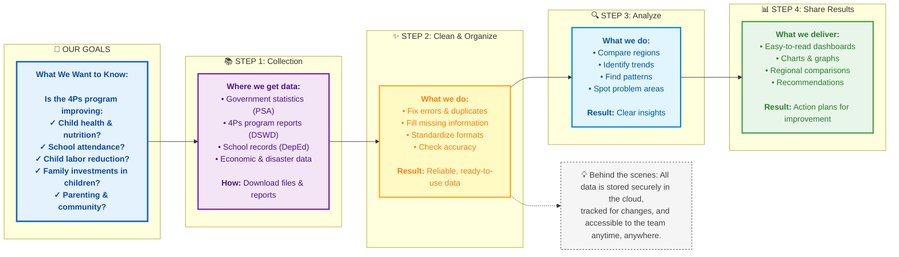

```mermaid
graph LR
    %% ===== PROJECT OBJECTIVES =====
    subgraph PROJECT_OBJECTIVES["⚡ PROJECT OBJECTIVES"]
        OBJ["🎯 5 Key Objectives:<br/>① Health & Nutrition<br/>② School Enrollment & Attendance<br/>③ Reduce Child Labor<br/>④ Human Capital Investment<br/>⑤ Parenting & Community Participation<br/>Other influencers (GRDP, calamities, government policies, etc.)"]
    end
    
    %% ===== DATA SOURCES =====
    subgraph DATA_SOURCES["📊 DATA SOURCES"]
        PSA["📈 PSA<br/>(Philippine Statistics Authority)"]
        DSWD["📋 DSWD<br/>Implementation Reports"]
        DEPED["🎓 DepEd<br/>(Department of Education)"] 
    end
    
    %% ===== DATA EXTRACTION =====
    subgraph DATA_EXTRACTION["🔍 DATA EXTRACTION"]
        CSV["📁 CSV/Excel<br/>Direct Download"]
        SCRAPE["🕷️ Web Scraping<br/>PDF Tables (tabula/pdfplumber)"]
    end
    
    %% ===== DATA LOADING =====
    subgraph DATA_LOADING_RAW["📥 DATA LOADING → RAW"]
        DLT["⚙️ dlt Pipeline<br/>(Data Load Tool)"]
        DBRAW["🗄️ DBeaver<br/>RAW Storage Layer"]
    end
    
    %% ===== DATA TRANSFORMATION =====
    subgraph DATA_TRANSFORMATION["🔄 DATA TRANSFORMATION"]
        DBT["🛠️ dbt<br/>Main Transformation<br/>+ pdfplumber/tabula"]
        DBCLEAN["✨ DBeaver<br/>CLEAN Storage Layer"]
    end
    
    %% ===== DATA QUALITY =====
    subgraph DATA_QUALITY["✅ DATA QUALITY"]
        VALIDATION["🔍 Data Validation<br/>RAW ⟷ CLEAN Check"]
    end
    
    %% ===== DATA MODELING =====
    subgraph DATA_MODELING["🏗️ DATA MODELING"]
        SANDBOX["🧪 SANDBOX<br/>• Normalization<br/>• Schema Design<br/>• Testing"]
        MART["📦 MART Layer<br/>• Fact Tables<br/>• Dimension Tables"]
    end
    
    %% ===== VISUALIZATION =====
    subgraph VISUALIZATION_ANALYSIS["📊 VISUALIZATION & ANALYSIS"]
        TABLEAU["📉 Tableau<br/>Dashboards & Reports"]
        INSIGHTS["💡 Output<br/>Regional Analysis &<br/>Intervention Recommendations"]
    end
    
    %% ===== NOTE NODE =====
    NOTE["💡 INFRASTRUCTURE NOTE<br/>━━━━━━━━━━━━━━━━━━━<br/>🔹 GitHub: Version Control & Repository<br/>🔹 Docker: Environment Integration<br/>🔹 VS Code ↔ DBeaver ↔ Tableau"]
    
    %% ===== FLOW CONNECTIONS =====
    OBJ ==> PSA
    OBJ ==> DSWD
    OBJ ==> DEPED
    
    PSA ==> CSV
    DSWD ==> CSV
    DSWD ==> SCRAPE
    DEPED ==> SCRAPE
    
    CSV ==> DLT
    SCRAPE ==> DLT
    
    DLT ==> DBRAW
    
    DBRAW ==> DBT
    
    DBT ==> DBCLEAN
    
    DBRAW -.->|Quality Check| VALIDATION
    DBCLEAN -.->|Quality Check| VALIDATION
    
    DBCLEAN ==> SANDBOX
    
    SANDBOX ==> MART
    
    MART ==> TABLEAU
    
    TABLEAU ==> INSIGHTS
    
    %% Position NOTE next to transformation
    DBT -.->|Infrastructure| NOTE
    
    %% ===== STYLING =====
    classDef objStyle fill:#f0f9ff,stroke:#0369a1,stroke-width:3px,color:#0c4a6e,font-weight:bold;
    classDef sourceStyle fill:#faf5ff,stroke:#7c3aed,stroke-width:2.5px,color:#6b21a8;
    classDef extractStyle fill:#eff6ff,stroke:#2563eb,stroke-width:2.5px,color:#1e40af;
    classDef loadStyle fill:#ecfeff,stroke:#0891b2,stroke-width:2.5px,color:#0e7490;
    classDef transformStyle fill:#f0fdf4,stroke:#16a34a,stroke-width:2.5px,color:#15803d;
    classDef qualityStyle fill:#fffbeb,stroke:#d97706,stroke-width:2.5px,color:#b45309;
    classDef modelStyle fill:#f5f3ff,stroke:#7c3aed,stroke-width:2.5px,color:#6b21a8;
    classDef vizStyle fill:#fdf4ff,stroke:#c026d3,stroke-width:2.5px,color:#a21caf;
    classDef noteStyle fill:#f8fafc,stroke:#0891b2,stroke-width:2px,stroke-dasharray: 5 5,color:#0e7490,font-family:monospace;
    
    %% Apply styles to nodes
    class OBJ objStyle;
    class PSA,DSWD,DEPED sourceStyle;
    class CSV,SCRAPE extractStyle;
    class DLT,DBRAW loadStyle;
    class DBT,PDFCLEAN,DBCLEAN transformStyle;
    class VALIDATION qualityStyle;
    class SANDBOX,MART modelStyle;
    class TABLEAU,INSIGHTS vizStyle;
    class NOTE noteStyle;
    
    %% Apply styles to subgraphs
    class PROJECT_OBJECTIVES objStyle;
    class DATA_SOURCES sourceStyle;
    class DATA_EXTRACTION extractStyle;
    class DATA_LOADING_RAW loadStyle;
    class DATA_TRANSFORMATION transformStyle;
    class DATA_QUALITY qualityStyle;
    class DATA_MODELING modelStyle;
    class VISUALIZATION_ANALYSIS vizStyle;
```

## Detailed

```mermaid
graph LR
    %% ===== PROJECT START =====
    START(["<b>PROJECT START</b><br/>4Ps Program Analysis"])
    
    %% ===== PHASE 0: PROJECT FOUNDATION =====
    subgraph PHASE0["<b>Phase 0: Project Foundation</b>"]
        P0_1["0.1 Objective<br/>Definition<br/><br/>5 Key Objectives:<br/>Health, Education,<br/>Child Labor, Human<br/>Capital, Parenting"]
        P0_2["0.2 Data Source<br/>Identification<br/><br/>PSA, DSWD, DepEd<br/>GRDP, LGU, Disasters"]
        GATE0{"<b>Gate 0:</b><br/>Foundation<br/>Check"}
    end
    
    %% ===== PHASE 1: DATA COLLECTION =====
    subgraph PHASE1["<b>Phase 1: Data Collection</b>"]
        P1_1["1.1 Data Source<br/>Assessment<br/><br/>CSV/Excel available?<br/>PDF scraping needed?"]
        DEC1_1{"Data<br/>Available?"}
        P1_2["1.2 Data Extraction<br/><br/>• CSV/Excel download<br/>• Web scraping<br/>(tabula/pdfplumber)"]
        DEC1_2{"Extraction<br/>Successful?"}
        GATE1{"<b>Gate 1:</b><br/>Data Collection<br/>Complete?"}
    end
    
    %% ===== PHASE 2: DATA LOADING =====
    subgraph PHASE2["<b>Phase 2: Data Loading & Infrastructure</b>"]
        P2_1["2.1 dlt Pipeline<br/>Setup<br/><br/>Configure data<br/>load tool"]
        P2_2["2.2 GitHub &<br/>Docker Setup<br/><br/>Version control<br/>Remote sessions"]
        P2_3["2.3 Load to<br/>DBeaver RAW<br/><br/>Raw storage layer"]
        DEC2{"RAW Data<br/>Loaded<br/>Correctly?"}
        GATE2{"<b>Gate 2:</b><br/>Loading<br/>OK?"}
    end
    
    %% ===== PHASE 3: DATA TRANSFORMATION =====
    subgraph PHASE3["<b>Phase 3: Data Transformation</b>"]
        P3_1["3.1 dbt<br/>Transformation<br/><br/>Main data cleaning<br/>& transformation"]
        P3_2["3.2 PDF Additional<br/>Cleaning<br/><br/>pdfplumber/tabula<br/>if needed"]
        P3_3["3.3 Load to<br/>DBeaver CLEAN<br/><br/>Clean storage layer"]
        GATE3{"<b>Gate 3:</b><br/>Transform<br/>Complete?"}
    end
    
    %% ===== PHASE 4: DATA QUALITY =====
    subgraph PHASE4["<b>Phase 4: Data Quality Assurance</b>"]
        P4_1["4.1 Data Validation<br/><br/>RAW vs CLEAN<br/>comparison"]
        DEC4_1{"Data<br/>Quality<br/>Issues?"}
        P4_2["4.2 Data Quality<br/>Verification<br/><br/>Completeness<br/>Accuracy<br/>Consistency"]
        DEC4_2{"Validation<br/>Passed?"}
        GATE4{"<b>Gate 4:</b><br/>Quality<br/>Assured?"}
    end
    
    %% ===== PHASE 5: DATA MODELING =====
    subgraph PHASE5["<b>Phase 5: Data Modeling</b>"]
        P5_1["5.1 SANDBOX<br/>Exploration<br/><br/>Normalization<br/>Schema design<br/>Testing"]
        P5_2["5.2 Fact & Dimension<br/>Table Design<br/><br/>Star/Snowflake<br/>schema"]
        P5_3["5.3 Load to<br/>DBeaver MART<br/><br/>Production tables"]
        DEC5{"Model<br/>Structure<br/>Valid?"}
        GATE5{"<b>Gate 5:</b><br/>Model<br/>Ready?"}
    end
    
    %% ===== PHASE 6: VISUALIZATION =====
    subgraph PHASE6["<b>Phase 6: Visualization & Analysis</b>"]
        P6_1["6.1 Tableau<br/>Connection<br/><br/>Connect DBeaver<br/>to Tableau"]
        P6_2["6.2 Dashboard<br/>Development<br/><br/>Regional analysis<br/>visualizations"]
        P6_3["6.3 Intervention<br/>Recommendations<br/><br/>Per region insights"]
        DEC6{"Dashboards<br/>Meeting<br/>Objectives?"}
        GATE6{"<b>Gate 6:</b><br/>Analysis<br/>Complete?"}
    end
    
    %% ===== PHASE 7: DELIVERY =====
    subgraph PHASE7["<b>Phase 7: Final Delivery</b>"]
        P7_1["7.1 Documentation<br/><br/>Process docs<br/>Data dictionary<br/>User guides"]
        P7_2["7.2 Stakeholder<br/>Presentation<br/><br/>Results & insights"]
        FINAL["<b>PROJECT COMPLETE</b><br/>4Ps Analysis Delivered"]
    end
    
    %% ===== MAIN FLOW =====
    START --> P0_1
    P0_1 --> P0_2
    P0_2 --> GATE0
    GATE0 -->|Pass| P1_1
    GATE0 -->|Fail| P0_1
    
    P1_1 --> DEC1_1
    DEC1_1 -->|No| P1_1
    DEC1_1 -->|Yes| P1_2
    P1_2 --> DEC1_2
    DEC1_2 -->|No| P1_2
    DEC1_2 -->|Yes| GATE1
    GATE1 -->|Pass| P2_1
    GATE1 -->|Fail| P1_1
    
    P2_1 --> P2_2
    P2_2 --> P2_3
    P2_3 --> DEC2
    DEC2 -->|No| P2_3
    DEC2 -->|Yes| GATE2
    GATE2 -->|Pass| P3_1
    GATE2 -->|Fail| P2_1
    
    P3_1 --> P3_2
    P3_2 --> P3_3
    P3_3 --> GATE3
    GATE3 -->|Pass| P4_1
    GATE3 -->|Fail| P3_1
    
    P4_1 --> DEC4_1
    DEC4_1 -->|Yes| P3_1
    DEC4_1 -->|No| P4_2
    P4_2 --> DEC4_2
    DEC4_2 -->|No| P4_1
    DEC4_2 -->|Yes| GATE4
    GATE4 -->|Pass| P5_1
    GATE4 -->|Fail| P4_1
    
    P5_1 --> P5_2
    P5_2 --> P5_3
    P5_3 --> DEC5
    DEC5 -->|No| P5_1
    DEC5 -->|Yes| GATE5
    GATE5 -->|Pass| P6_1
    GATE5 -->|Fail| P5_1
    
    P6_1 --> P6_2
    P6_2 --> P6_3
    P6_3 --> DEC6
    DEC6 -->|No| P6_2
    DEC6 -->|Yes| GATE6
    GATE6 -->|Pass| P7_1
    GATE6 -->|Fail| P6_1
    
    P7_1 --> P7_2
    P7_2 --> FINAL
    
    %% ===== STYLING =====
    classDef startStyle fill:#f8f9fa,stroke:#000000,stroke-width:3px,color:#000000;
    classDef phase0Style fill:#fff3cd,stroke:#856404,stroke-width:2px,color:#856404;
    classDef phase1Style fill:#e7f3ff,stroke:#004085,stroke-width:2px,color:#004085;
    classDef phase2Style fill:#d1ecf1,stroke:#0c5460,stroke-width:2px,color:#0c5460;
    classDef phase3Style fill:#d4edda,stroke:#155724,stroke-width:2px,color:#155724;
    classDef phase4Style fill:#fff3cd,stroke:#856404,stroke-width:2px,color:#856404;
    classDef phase5Style fill:#e2d9f3,stroke:#6f42c1,stroke-width:2px,color:#4a148c;
    classDef phase6Style fill:#fce4ec,stroke:#880e4f,stroke-width:2px,color:#880e4f;
    classDef phase7Style fill:#e8f5e9,stroke:#2e7d32,stroke-width:2px,color:#1b5e20;
    classDef gateStyle fill:#ffd966,stroke:#bf8f00,stroke-width:2.5px,color:#000000;
    classDef decisionStyle fill:#cfe2ff,stroke:#084298,stroke-width:2px,color:#084298;
    classDef finalStyle fill:#d4edda,stroke:#155724,stroke-width:3px,color:#155724;
    
    class START startStyle;
    class P0_1,P0_2 phase0Style;
    class P1_1,P1_2 phase1Style;
    class P2_1,P2_2,P2_3 phase2Style;
    class P3_1,P3_2,P3_3 phase3Style;
    class P4_1,P4_2 phase4Style;
    class P5_1,P5_2,P5_3 phase5Style;
    class P6_1,P6_2,P6_3 phase6Style;
    class P7_1,P7_2 phase7Style;
    class GATE0,GATE1,GATE2,GATE3,GATE4,GATE5,GATE6 gateStyle;
    class DEC1_1,DEC1_2,DEC2,DEC4_1,DEC4_2,DEC5,DEC6 decisionStyle;
    class FINAL finalStyle;
```

```mermaid
graph LR
    %% ===== PROGRAM GOALS =====
    subgraph GOALS["🎯 OUR GOALS"]
        OBJ["<b>What We Want to Know:</b><br/><br/>Is the 4Ps program improving:<br/>✓ Child health & nutrition?<br/>✓ School attendance?<br/>✓ Child labor reduction?<br/>✓ Family investments in children?<br/>✓ Parenting & community?"]
    end
    
    %% ===== STEP 1 =====
    subgraph STEP1["📚 STEP 1: Collection"]
        COLLECT["<b>Where we get data:</b><br/>• Government statistics (PSA)<br/>• 4Ps program reports (DSWD)<br/>• School records (DepEd)<br/>• Economic & disaster data<br/><br/><b>How:</b> Download files & reports"]
    end
    
    %% ===== STEP 2 =====
    subgraph STEP2["✨ STEP 2: Clean & Organize"]
        CLEAN["<b>What we do:</b><br/>• Fix errors & duplicates<br/>• Fill missing information<br/>• Standardize formats<br/>• Check accuracy<br/><br/><b>Result:</b> Reliable, ready-to-use data"]
    end
    
    %% ===== STEP 3 =====
    subgraph STEP3["🔍 STEP 3: Analyze"]
        ANALYZE["<b>What we do:</b><br/>• Compare regions<br/>• Identify trends<br/>• Find patterns<br/>• Spot problem areas<br/><br/><b>Result:</b> Clear insights"]
    end
    
    %% ===== STEP 4 =====
    subgraph STEP4["📊 STEP 4: Share Results"]
        RESULTS["<b>What we deliver:</b><br/>• Easy-to-read dashboards<br/>• Charts & graphs<br/>• Regional comparisons<br/>• Recommendations<br/><br/><b>Result:</b> Action plans for improvement"]
    end
    
    %% ===== SUPPORT NOTE =====
    NOTE["💡 Behind the scenes: All data is stored securely in the cloud,<br/>tracked for changes, and accessible to the team anytime, anywhere."]
    
    %% ===== FLOW =====
    OBJ --> COLLECT
    COLLECT --> CLEAN
    CLEAN --> ANALYZE
    ANALYZE --> RESULTS
    
    CLEAN -.-> NOTE
    
    %% ===== STYLING =====
    classDef goalsStyle fill:#e3f2fd,stroke:#1565c0,stroke-width:3px,color:#0d47a1,font-weight:bold;
    classDef step1Style fill:#f3e5f5,stroke:#7b1fa2,stroke-width:2.5px,color:#4a148c;
    classDef step2Style fill:#fff9c4,stroke:#f9a825,stroke-width:2.5px,color:#f57f17;
    classDef step3Style fill:#e1f5fe,stroke:#0288d1,stroke-width:2.5px,color:#01579b;
    classDef step4Style fill:#e8f5e9,stroke:#43a047,stroke-width:2.5px,color:#2e7d32;
    classDef noteStyle fill:#f5f5f5,stroke:#757575,stroke-width:1.5px,color:#424242,stroke-dasharray:3 3;
    
    class OBJ goalsStyle;
    class COLLECT step1Style;
    class CLEAN step2Style;
    class ANALYZE step3Style;
    class RESULTS step4Style;
    class NOTE noteStyle;
```
