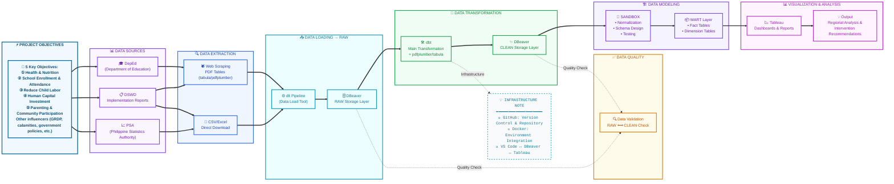

```mermaid
graph LR
    %% ===== PROJECT OBJECTIVES =====
    subgraph PROJECT_OBJECTIVES["⚡ PROJECT OBJECTIVES"]
        OBJ["🎯 5 Key Objectives:<br/>① Health & Nutrition<br/>② School Enrollment & Attendance<br/>③ Reduce Child Labor<br/>④ Human Capital Investment<br/>⑤ Parenting & Community Participation<br/>Other influencers (GRDP, calamities, government policies, etc.)"]
    end
    
    %% ===== DATA SOURCES =====
    subgraph DATA_SOURCES["📊 DATA SOURCES"]
        PSA["📈 PSA<br/>(Philippine Statistics Authority)"]
        DSWD["📋 DSWD<br/>Implementation Reports"]
        DEPED["🎓 DepEd<br/>(Department of Education)"] 
    end
    
    %% ===== DATA EXTRACTION =====
    subgraph DATA_EXTRACTION["🔍 DATA EXTRACTION"]
        CSV["📁 CSV/Excel<br/>Direct Download"]
        SCRAPE["🕷️ Web Scraping<br/>PDF Tables (tabula/pdfplumber)"]
    end
    
    %% ===== DATA LOADING =====
    subgraph DATA_LOADING_RAW["📥 DATA LOADING → RAW"]
        DLT["⚙️ dlt Pipeline<br/>(Data Load Tool)"]
        DBRAW["🗄️ DBeaver<br/>RAW Storage Layer"]
    end
    
    %% ===== DATA TRANSFORMATION =====
    subgraph DATA_TRANSFORMATION["🔄 DATA TRANSFORMATION"]
        DBT["🛠️ dbt<br/>Main Transformation<br/>+ pdfplumber/tabula"]
        DBCLEAN["✨ DBeaver<br/>CLEAN Storage Layer"]
    end
    
    %% ===== DATA QUALITY =====
    subgraph DATA_QUALITY["✅ DATA QUALITY"]
        VALIDATION["🔍 Data Validation<br/>RAW ⟷ CLEAN Check"]
    end
    
    %% ===== DATA MODELING =====
    subgraph DATA_MODELING["🏗️ DATA MODELING"]
        SANDBOX["🧪 SANDBOX<br/>• Normalization<br/>• Schema Design<br/>• Testing"]
        MART["📦 MART Layer<br/>• Fact Tables<br/>• Dimension Tables"]
    end
    
    %% ===== VISUALIZATION =====
    subgraph VISUALIZATION_ANALYSIS["📊 VISUALIZATION & ANALYSIS"]
        TABLEAU["📉 Tableau<br/>Dashboards & Reports"]
        INSIGHTS["💡 Output<br/>Regional Analysis &<br/>Intervention Recommendations"]
    end
    
    %% ===== NOTE NODE =====
    NOTE["💡 INFRASTRUCTURE NOTE<br/>━━━━━━━━━━━━━━━━━━━<br/>🔹 GitHub: Version Control & Repository<br/>🔹 Docker: Environment Integration<br/>🔹 VS Code ↔ DBeaver ↔ Tableau"]
    
    %% ===== FLOW CONNECTIONS =====
    OBJ ==> PSA
    OBJ ==> DSWD
    OBJ ==> DEPED
    
    PSA ==> CSV
    DSWD ==> CSV
    DSWD ==> SCRAPE
    DEPED ==> SCRAPE
    
    CSV ==> DLT
    SCRAPE ==> DLT
    
    DLT ==> DBRAW
    
    DBRAW ==> DBT
    
    DBT ==> DBCLEAN
    
    DBRAW -.->|Quality Check| VALIDATION
    DBCLEAN -.->|Quality Check| VALIDATION
    
    DBCLEAN ==> SANDBOX
    
    SANDBOX ==> MART
    
    MART ==> TABLEAU
    
    TABLEAU ==> INSIGHTS
    
    %% Position NOTE next to transformation
    DBT -.->|Infrastructure| NOTE
    
    %% ===== STYLING =====
    classDef objStyle fill:#f0f9ff,stroke:#0369a1,stroke-width:3px,color:#0c4a6e,font-weight:bold;
    classDef sourceStyle fill:#faf5ff,stroke:#7c3aed,stroke-width:2.5px,color:#6b21a8;
    classDef extractStyle fill:#eff6ff,stroke:#2563eb,stroke-width:2.5px,color:#1e40af;
    classDef loadStyle fill:#ecfeff,stroke:#0891b2,stroke-width:2.5px,color:#0e7490;
    classDef transformStyle fill:#f0fdf4,stroke:#16a34a,stroke-width:2.5px,color:#15803d;
    classDef qualityStyle fill:#fffbeb,stroke:#d97706,stroke-width:2.5px,color:#b45309;
    classDef modelStyle fill:#f5f3ff,stroke:#7c3aed,stroke-width:2.5px,color:#6b21a8;
    classDef vizStyle fill:#fdf4ff,stroke:#c026d3,stroke-width:2.5px,color:#a21caf;
    classDef noteStyle fill:#f8fafc,stroke:#0891b2,stroke-width:2px,stroke-dasharray: 5 5,color:#0e7490,font-family:monospace;
    
    %% Apply styles to nodes
    class OBJ objStyle;
    class PSA,DSWD,DEPED sourceStyle;
    class CSV,SCRAPE extractStyle;
    class DLT,DBRAW loadStyle;
    class DBT,PDFCLEAN,DBCLEAN transformStyle;
    class VALIDATION qualityStyle;
    class SANDBOX,MART modelStyle;
    class TABLEAU,INSIGHTS vizStyle;
    class NOTE noteStyle;
    
    %% Apply styles to subgraphs
    class PROJECT_OBJECTIVES objStyle;
    class DATA_SOURCES sourceStyle;
    class DATA_EXTRACTION extractStyle;
    class DATA_LOADING_RAW loadStyle;
    class DATA_TRANSFORMATION transformStyle;
    class DATA_QUALITY qualityStyle;
    class DATA_MODELING modelStyle;
    class VISUALIZATION_ANALYSIS vizStyle;
```

```mermaid
graph LR
    %% ===== PROJECT OBJECTIVES =====
    subgraph PROJECT_OBJECTIVES["⚡ PROJECT OBJECTIVES"]
        OBJ["🎯 5 Key Objectives:<br/> Health & Nutrition<br/> School Enrollment & Attendance<br/> Reduce Child Labor<br/> Human Capital Investment<br/> Parenting & Community Participation<br/> Other influencers (GRDP, calamities, government policies, etc."]
    end
    
    %% ===== DATA SOURCES =====
    subgraph DATA_SOURCES["📊 DATA SOURCES"]
        PSA["📈 PSA<br/>(Philippine Statistics Authority)"]
        DSWD["📋 DSWD<br/>Implementation Reports"]
        DEPED["🎓 DepEd<br/>(Department of Education)"] 
    end
    
    %% ===== DATA EXTRACTION =====
    subgraph DATA_EXTRACTION["🔍 DATA EXTRACTION"]
        CSV["📁 CSV/Excel<br/>Direct Download"]
        SCRAPE["🕷️ Web Scraping<br/>PDF Tables (tabula/pdfplumber)"]
    end
    
    %% ===== DATA LOADING =====
    subgraph DATA_LOADING_RAW["📥 DATA LOADING → RAW"]
        DLT["⚙️ dlt Pipeline<br/>(Data Load Tool)"]
        DBRAW["🗄️ DBeaver<br/>RAW Storage Layer"]
    end
    
    %% ===== DATA TRANSFORMATION =====
    subgraph DATA_TRANSFORMATION["🔄 DATA TRANSFORMATION"]
        DBT["🛠️ dbt<br/>Main Transformation<br/>+ pdfplumber/tabula"]
        DBCLEAN["✨ DBeaver<br/>CLEAN Storage Layer"]
    end
    
    %% ===== NOTE NODE =====
    NOTE["💡 INFRASTRUCTURE NOTE<br/>━━━━━━━━━━━━━━━━━━━<br/>🔹 GitHub: Version Control & Repository<br/>🔹 Docker: Environment Integration<br/>🔹 VS Code ↔ DBeaver ↔ Tableau"]
    
    %% ===== DATA QUALITY =====
    subgraph DATA_QUALITY["✅ DATA QUALITY"]
        VALIDATION["🔍 Data Validation<br/>RAW ⟷ CLEAN Check"]
    end
    
    %% ===== DATA MODELING =====
    subgraph DATA_MODELING["🏗️ DATA MODELING"]
        SANDBOX["🧪 SANDBOX<br/>• Normalization<br/>• Schema Design<br/>• Testing"]
        MART["📦 MART Layer<br/>• Fact Tables<br/>• Dimension Tables"]
    end
    
    %% ===== VISUALIZATION =====
    subgraph VISUALIZATION_ANALYSIS["📊 VISUALIZATION & ANALYSIS"]
        TABLEAU["📉 Tableau<br/>Dashboards & Reports"]
        INSIGHTS["💡 Output<br/>Regional Analysis &<br/>Intervention Recommendations"]
    end
    
    %% ===== FLOW CONNECTIONS =====
    OBJ ==> PSA
    OBJ ==> DSWD
    OBJ ==> DEPED
    
    PSA ==> CSV
    DSWD ==> CSV
    DSWD ==> SCRAPE
    DEPED ==> SCRAPE
    
    CSV ==> DLT
    SCRAPE ==> DLT
    
    DLT ==> DBRAW
    
    DBRAW ==> DBT
    
    DBT ==> DBCLEAN
    
    DBRAW -.->|Quality Check| VALIDATION
    DBCLEAN -.->|Quality Check| VALIDATION
    
    DBCLEAN ==> SANDBOX
    
    SANDBOX ==> MART
    
    MART ==> TABLEAU
    
    TABLEAU ==> INSIGHTS
    
    %% Position NOTE next to transformation
    DBT -.->|Infrastructure| NOTE
    
    %% ===== STYLING =====
    classDef objStyle fill:#f0f9ff,stroke:#0369a1,stroke-width:3px,color:#0c4a6e,font-weight:bold;
    classDef sourceStyle fill:#faf5ff,stroke:#7c3aed,stroke-width:2.5px,color:#6b21a8;
    classDef extractStyle fill:#eff6ff,stroke:#2563eb,stroke-width:2.5px,color:#1e40af;
    classDef loadStyle fill:#ecfeff,stroke:#0891b2,stroke-width:2.5px,color:#0e7490;
    classDef transformStyle fill:#f0fdf4,stroke:#16a34a,stroke-width:2.5px,color:#15803d;
    classDef qualityStyle fill:#fffbeb,stroke:#d97706,stroke-width:2.5px,color:#b45309;
    classDef modelStyle fill:#f5f3ff,stroke:#7c3aed,stroke-width:2.5px,color:#6b21a8;
    classDef vizStyle fill:#fdf4ff,stroke:#c026d3,stroke-width:2.5px,color:#a21caf;
    classDef noteStyle fill:#f8fafc,stroke:#0891b2,stroke-width:2px,stroke-dasharray: 5 5,color:#0e7490,font-family:monospace;
    
    %% Apply styles to nodes
    class OBJ objStyle;
    class PSA,DSWD,DEPED sourceStyle;
    class CSV,SCRAPE extractStyle;
    class DLT,DBRAW loadStyle;
    class DBT,PDFCLEAN,DBCLEAN transformStyle;
    class VALIDATION qualityStyle;
    class SANDBOX,MART modelStyle;
    class TABLEAU,INSIGHTS vizStyle;
    class NOTE noteStyle;
    
    %% Apply styles to subgraphs
    class PROJECT_OBJECTIVES objStyle;
    class DATA_SOURCES sourceStyle;
    class DATA_EXTRACTION extractStyle;
    class DATA_LOADING_RAW loadStyle;
    class DATA_TRANSFORMATION transformStyle;
    class DATA_QUALITY qualityStyle;
    class DATA_MODELING modelStyle;
    class VISUALIZATION_ANALYSIS vizStyle;
```
