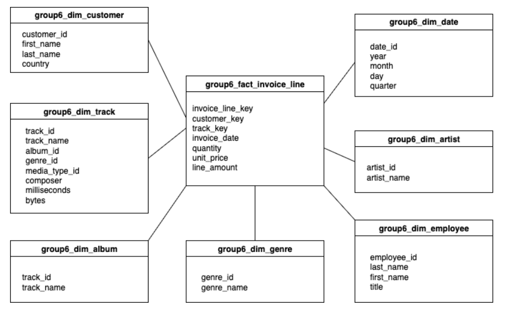

# 🎵Documentation: Chinook Music Store

---

## 1. Project Overview - 

- **Dataset Used:**  
  Dataset: Chinook music store

  Domain:artists, albums, tracks, genres, playlist, media type, customer, employee, invoice, invoice line

- **Goal of the Exercise:**  
  Convert the Chinook dataset into a dimensional model to answer business questions. After creating the schema, do the RCM pipeline.

- **Team Setup:**  
  *(State if you worked individually, as a group, or both. Mention collaboration style.)*  

---

## 2. Architecture & Workflow
- **Pipeline Flow:**  
  **raw → clean → mart → Metabase**  

- **Tools Used:**  
  - Ingestion: `dlt`  
  - Modeling: `dbt`  
  - Visualization: `Metabase`  

- **Medallion Architecture Application:**  
  - **Bronze (Raw):** Initial ingestion of source data  
  - **Silver (Clean):** Cleaning, type casting, handling missing values  
  - **Gold (Mart):** Business-ready star schema for BI  

---

## 3. Modeling Process 

- **Star Schema Design:**  

 

- **Challenges / Tradeoffs:**  
  - Repeating tables due to **append** 

---

## 4. Collaboration & Setup - Monette

- **Task Splitting:**  
  - One person is assigned for ingestion, cleaning, until pushing to mart
  - Each one took a business question to visualize and query using metabase
  - Each one collaborates in creating the documentation

- **Shared vs Local Work:**  
  - Server went down and since we were doing things the last minute, that has also affected our workflow greatly 

- **Best Practices Learned:**  
  - Learn how to collaborate 

---

## 5. Business Questions & Insights

- **Business Questions Explored:**  
  1. Which music genres generate the most revenue in each country?
  2. How many customers fall into each tier - high, medium, low? 
  3. How has revenue trended month-by-month over the last 2 years?
  4. What are the top 20 tracks by total units sold, and which albums/artists do they belong to?
  5. Do average unit prices differ across countries or regions?

- **Dashboards / Queries:**  
  *(Add screenshots, SQL snippets, or summaries of dashboards created in Metabase.)*
  ```sql
SELECT
    cu.country,
    ge.genre_name,
    SUM(il.line_amount) AS total_revenue
FROM
    group6_fact_line_invoice il
JOIN group6_dim_track t ON il.track_key = t.track_id
JOIN group6_dim_genre ge ON t.genre_id = ge.genre_id
JOIN group6_dim_customer cu ON il.customer_key = cu.customer_id
GROUP BY
    cu.country,
    ge.genre_name
ORDER BY
    cu.country,
    total_revenue DESC;

- **Key Insights:**  
  - Rock is the most profitable genre in the US with heavy margins compared to the others
  - 

---

## 6. Key Learnings

- **Technical Learnings:**  
  - Creating Fact and Dim table using SQL

- **Team Learnings:**  
  - Collaborating using remote setup

- **Real-World Connection:**  
  - The exercise showed how it is possible for data engineers to connect and collaborate with each other.

---

## 7. Future Improvements

- **Next Steps with More Time:**
  - Each one of use would try it out and we would present with each other how we did the exercise.

- **Generalization:**  
  *(How this workflow could be applied to other datasets or business domains.)*  

---

## 📢 Presentation Tips

- Keep it **5–10 minutes**, like a project walkthrough.  
- Use **diagrams, screenshots, and SQL snippets**.  
- Focus on both **technical process** and **business insights**.  
- End with your **key learnings and future improvements**.  
- For other documentation tips. Read [this](TECHNICAL-DOCS.md).

---

✅ By filling this template, your group will produce a professional-style project guide **just like real data engineers** — clear, structured, and insight-driven.
