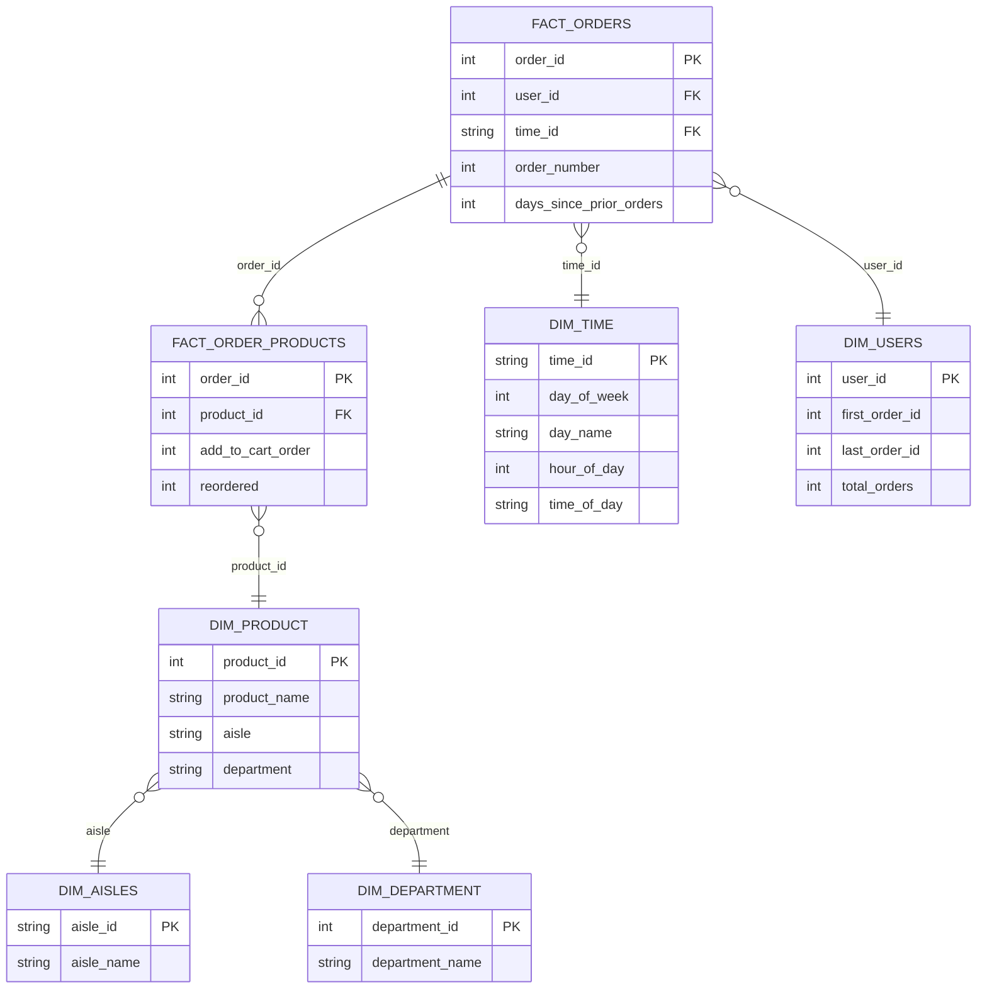

# 🛒 InstaCart Online Grocery Basket dataset

This repository contains an end-to-end data pipeline built around the **InstaCart Online Grocery Basket dataset**, a real-world dataset that captures customer purchasing behavior across thousands of grocery orders.

---

## 1. Project Overview

- **Dataset Used:**  
  - InstaCart Online Grocery Basket Analysis Dataset

- **Goal of the Exercise:**  
  - Develop a business question, Apply Normalization → Dimensional Modeling → Data Quality Dashboard using the Instacart Market Basket dataset.

- **Team Setup:**  
  - The team collaborated by dividing responsibilities across data modeling, dashboard development, data quality testing, and documentation. Workloads were adjusted according to each member’s availability. 

- **Environment Setup:**  
  - Docker containers ran on a shared VM and local laptops, ensuring consistent and collaborative development.

---

## 2. Architecture & Workflow

- **Pipeline Flow:**
  ```mermaid
    graph LR
        A[dlt ingestion] --> B[ClickHouse - raw schema]
        B --> C[dbt - clean schema]
        C --> F[Data quality testing]
        F --> D[dbt - mart schema]
        D --> E[Metabase dashboards]
  ```


- **Tools Used:**  
  - Ingestion: `dlt`  
  - Modeling: `dbt`
  - Data Quality: 
  - Visualization: `Metabase`  

- **Medallion Architecture Application:**  
  - **Bronze (Raw):** Initial ingestion of source data  
  - **Silver (Clean):** Cleaning, type casting, handling missing values  
  - **Gold (Mart):** Business-ready star schema for BI  
 

---

## 3. Modeling Process

- **Source Structure (Normalized):**  
  To optimize for analytical queries, the data was restructured into a **star schema** with a central fact table and supporting dimension tables.

 - **Star Schema:**



  - **Fact Tables:**  
    - `fact_orders` – consolidated order-level data including customer, product, and time references.  
    - `fact_order_products` – captured detailed order-product relationships (quantities, prices, and department linkage).

      ### 🧩 `fact_orders.sql`
      
      ```sql
      {{ config(
          materialized = "table",
          schema = "mart"
      ) }}
      
      SELECT
          o.order_id,
          o.user_id,
          dt.time_id,
          o.order_number,
          o.days_since_prior_order
      FROM
          {{ source('clean', 'grp24_instacart_orders') }} AS o
      LEFT JOIN
          {{ source('mart', 'grp24_instacart_dim_time') }} AS dt 
          ON o.order_dow = dt.day_of_week 
         AND o.order_hour_of_day = dt.hour_of_day


  - **Dimension Tables:**  
    - `dim_product` – contained product details and their corresponding department and aisle.  
    - `dim_department` – listed department names and IDs.  
    - `dim_aisle` – represented product placement categories.  
    - `dim_user` – included user or customer-related attributes.  
    - `dim_time` – provided date and time breakdowns for trend analysis.
      
    ```sql   
    {{ config(materialized="table", schema="mart", tags=["mart","instacart"]) }}
    -- models/mart/2.4grp_instacart_dim_product.sql
    
    SELECT
        p.product_id,
        p.product_name,
        a.aisle,
        d.department
    FROM clean."2.4grp_instacart_products" AS p
    LEFT JOIN clean."2.4grp_instacart_aisles" AS a
        ON p.aisle_id = a.aisle_id
    LEFT JOIN clean."2.4grp_instacart_departments" AS d
        ON CAST(a.department_id AS String) = CAST(d.department_id AS String)
    WHERE p.product_id IS NOT NULL
    GROUP BY
        p.product_id,
        p.product_name,
        a.aisle,
        d.department

---

## 4. Collaboration & Setup

- **Task Splitting:**  
  * Modeling: dbt SQL transformations
  * Visualization: Metabase dashboards
  * Data Quality: 
  * Documentation: README & presentation outline

- **Best Practices Learned:**  
  * Use group tracker
  * Clear naming conventions for tables and models
  * Documenting assumptions and changes for smoother collaboration

---

## 5. Business Questions & Insights

- **Business Questions Explored:**  
  1. What is the average number of products per order?
  2. What is the average length of days since prior orders?
  3. What is the percentage of returning customers?
  4. What percentage of orders include reorders?
  5. What are Top 10 most reordered product along with their reorder rate?
  6. What aisle have the most reorders?
  7. Which users have the most reorders?
  8. Which department have the most orders?
  9. Which day of the week have the most orders?
  10. Which hour of the day have the most orders?

- **Dashboards / Queries:**  
  ```sql   
  SELECT
      p.d.department AS department,
      COUNT(f.order_id) AS total_sold
  FROM `2.4grp_instacart_fact_order_products` AS f
  JOIN `2.4grp_instacart_dim_product` AS p
      ON CAST(f.product_id AS String) = p.p.product_id
  GROUP BY p.d.department
  ORDER BY total_sold DESC;

- **Key Insights:**  
  - Reorders have a huge impact on sales.
  - Banana and Fresh Fruits have the most reorders.
  - Produce departments have the most order.
  - Most customers buy at Sunday at 10 AM to 3 PM.

---

## 6. Key Learnings

- **Technical Learnings:**  
* Data transformations & schema design with **dbt**
* Creating star schemas for BI queries
* SQL joins, aggregations, and window functions in ClickHouse

- **Team Learnings:**  
* Practiced consistent naming conventions and documentation, ensuring team-wide clarity and reproducibility.

- **Real-World Connection:**  
* Simulated the end-to-end process of maintaining data pipelines for business intelligence dashboards.

---

## 7. Future Improvements

- **Next Steps with More Time:**
- Revisit DQ checks

- **Generalization:**
