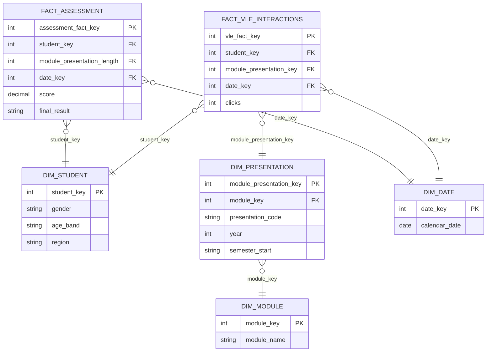

# Documentation: Open University Learning Analytics

---

## 1. Project Overview - 

- **Dataset Used:**  
  Dataset: Open University Learning Analytics dataset

  Domain: VLE, Student VLE, Student Registration, Student Info, Student Assessment, Courses, Assessments

- **Goal of the Exercise:**  
  1. Ingest CSVs into the `raw` schema.
  2. Standardize types, handle missing values in the `clean` schema.
  3. Design a star schema around **student performance & engagement**:
   * **Facts:** `FactAssessments`, `FactVLEInteractions`.
   * **Dimensions:** module, moduleVLE, presentation, registered module, student, date
  4. Implement in dbt (`mart` schema).
  5. Build dashboards in Metabase to analyze **cohorts, dropout risk, and engagement**.

- **Team Setup:**  
  1. We createad a monitoring sheet to monitor each one trying the task. (Link: https://docs.google.com/spreadsheets/d/1VOidsWkT1EnYQ2q9agZKiv-X-Abc_UGZ/edit?gid=504770803#gid=504770803)
  2. Each one tries to ingest and clean the data.
  3. We huddled to combine what we have done alone and then created the fact and dimension tables using one source of truth
  4. Each one input a code in Metabase to visualize answers to business questions.

---

## 2. Architecture & Workflow
- **Pipeline Flow:**  
  **raw → clean → mart → Metabase**  

- **Tools Used:**  
  - Ingestion: `dlt`  
  - Modeling: `dbt`  
  - Visualization: `Metabase`  

- **Medallion Architecture Application:**  
  - **Bronze (Raw):** Initial ingestion of source data  
  - **Silver (Clean):** Cleaning, type casting, handling missing values  
  - **Gold (Mart):** Business-ready star schema for BI  

### Raw Layer: Data Ingestion

- For the raw layer, tables from OULAD e are ingested using `dlt`. This step brings in source tables for downstream processing.

- **Example Extraction Code:**  
  Extraction uses Python functions decorated with `@dlt.resource`. For example, with the naming convention update:

```python
"# dlt/pipeline.py
import dlt, pandas as pd
import os
from glob import glob

# Approach 1: Single resource yielding multiple DataFrames
@dlt.resource(name=""monette_oulad"")
def oulad_all_files():
    ROOT_DIR = os.path.dirname(__file__)
    STAGING_DIR = os.path.join(ROOT_DIR, ""staging"", ""oulad"")
    
    # List all your CSV files
    csv_files = [
        ""assessments.csv"",
        ""courses.csv"", 
        ""studentAssessment.csv"",
        ""studentInfo.csv"",
        ""studentRegistration.csv"",
        ""vle.csv""
    ]
    
    for csv_file in csv_files:
        file_path = os.path.join(STAGING_DIR, csv_file)
        if os.path.exists(file_path):
            df = pd.read_csv(file_path)
            # Add a column to identify the source file
            df['_source_file'] = csv_file.replace('.csv', '')
            yield df
        else:
            print(f""Warning: File {csv_file} not found"")

# Approach 2: Separate resources for each file
@dlt.resource(name=""assessments"")
def assessments():
    ROOT_DIR = os.path.dirname(__file__)
    STAGING_DIR = os.path.join(ROOT_DIR, ""staging"", ""oulad"")
    FILE_PATH = os.path.join(STAGING_DIR, ""assessments.csv"")
    yield pd.read_csv(FILE_PATH)

@dlt.resource(name=""courses"")
def courses():
    ROOT_DIR = os.path.dirname(__file__)
    STAGING_DIR = os.path.join(ROOT_DIR, ""staging"", ""oulad"")
    FILE_PATH = os.path.join(STAGING_DIR, ""courses.csv"")
    yield pd.read_csv(FILE_PATH)

@dlt.resource(name=""student_assessment"")
def student_assessment():
    ROOT_DIR = os.path.dirname(__file__)
    STAGING_DIR = os.path.join(ROOT_DIR, ""staging"", ""oulad"")
    FILE_PATH = os.path.join(STAGING_DIR, ""studentAssessment.csv"")
    yield pd.read_csv(FILE_PATH)

@dlt.resource(name=""student_info"")
def student_info():
    ROOT_DIR = os.path.dirname(__file__)
    STAGING_DIR = os.path.join(ROOT_DIR, ""staging"", ""oulad"")
    FILE_PATH = os.path.join(STAGING_DIR, ""studentInfo.csv"")
    yield pd.read_csv(FILE_PATH)

@dlt.resource(name=""student_registration"")
def student_registration():
    ROOT_DIR = os.path.dirname(__file__)
    STAGING_DIR = os.path.join(ROOT_DIR, ""staging"", ""oulad"")
    FILE_PATH = os.path.join(STAGING_DIR, ""studentRegistration.csv"")
    yield pd.read_csv(FILE_PATH)
    
@dlt.resource(name=""vle"")
def vle():
    ROOT_DIR = os.path.dirname(__file__)
    STAGING_DIR = os.path.join(ROOT_DIR, ""staging"", ""oulad"")
    FILE_PATH = os.path.join(STAGING_DIR, ""vle.csv"")
    yield pd.read_csv(FILE_PATH)

# Approach 3: Dynamic file discovery
@dlt.resource(name=""oulad_dynamic"")
def oulad_dynamic():
    ROOT_DIR = os.path.dirname(__file__)
    STAGING_DIR = os.path.join(ROOT_DIR, ""staging"", ""oulad"")
    
    # Find all CSV files in the directory
    csv_pattern = os.path.join(STAGING_DIR, ""*.csv"")
    csv_files = glob(csv_pattern)
    
    for file_path in csv_files:
        df = pd.read_csv(file_path)
        # Add source file information
        filename = os.path.basename(file_path).replace('.csv', '')
        df['_source_file'] = filename
        yield df

def run_approach_1():
    """"""Single resource, all files combined""""""
    p = dlt.pipeline(
        pipeline_name=""oulad-pipeline"",
        destination=""clickhouse"",
        dataset_name=""monette_oulad"",
        dev_mode=True
    )
    print(""Fetching and loading all files as one resource..."")
    info = p.run(oulad_all_files())
    print(""Records loaded:"", info)

def run_approach_2():
    """"""Separate resources for each file""""""
    p = dlt.pipeline(
        pipeline_name=""oulad-pipeline"",
        destination=""clickhouse"",
        dataset_name=""monette_oulad"",
    )
    print(""Fetching and loading each file as separate resource..."")
    info = p.run([
        assessments(),
        courses(),
        student_assessment(),
        student_info(),
        student_registration(),
        vle()
    ])
    print(""Records loaded:"", info)

def run_approach_3():
    """"""Dynamic file discovery""""""
    p = dlt.pipeline(
        pipeline_name=""oulad-pipeline"",
        destination=""clickhouse"",
        dataset_name=""monette_oulad"",
    )
    print(""Fetching and loading dynamically discovered files..."")
    info = p.run(oulad_dynamic())
    print(""Records loaded:"", info)

if __name__ == ""__main__"":
    # Choose which approach to use:
    
    # Option 1: All files as one resource (creates one table)
    # run_approach_1()
    
    # Option 2: Each file as separate resource (creates separate tables)
    run_approach_2()
    
    # Option 3: Dynamic discovery (creates one table with source file column)
    # run_approach_3()"
# Approach 4
import dlt
import pandas as pd
import os
ROOT_DIR = os.path.dirname(__file__)
STAGING_DIR = os.path.join(ROOT_DIR, "staging", "oulad")
def resource_from_file(name, filename):
    """
    Loads a single CSV as a DataFrame for dlt, table named pau_{name}.
    """
    @dlt.resource(name=f"pau_{name}")
    def resource():
        file_path = os.path.join(STAGING_DIR, filename)
        return iter([pd.read_csv(file_path)])
    return resource
# Use the prefix 'pau_' for each resource/table name (matching dbt)
assessments = resource_from_file("assessments", "assessments.csv")
courses = resource_from_file("courses", "courses.csv")
student_assessment = resource_from_file("student_assessment", "studentAssessment.csv")
student_info = resource_from_file("student_info", "studentInfo.csv")
student_registration = resource_from_file("student_registration", "studentRegistration.csv")
vle = resource_from_file("vle", "vle.csv")
def run_pipeline():
    """
    Loads each CSV file into a separate table in the 'raw' schema, named pau_*.
    """
    p = dlt.pipeline(
        pipeline_name="oulad-pipeline",
        destination="clickhouse",
        dataset_name="raw",   # <-- schema must match dbt
    )
    print("Loading files as pau_* tables into raw schema...")
    info = p.run([
        assessments(),
        courses(),
        student_assessment(),
        student_info(),
        student_registration(),
        vle()
    ])
    print("Records loaded:", info)
if __name__ == "__main__":
    run_pipeline()
```


- **How Ingestion Was Run:**  
The pipeline was executed in the terminal:

```bash
docker compose --profile jobs run --rm dlt python extract-loads/09-dlt-oulad-pipeline.py
```


**Tables Ingested:**  
  - **vle**
  - **studentRegistration**
  - **studentInfo**
  - **studentAssessment**
  - **courses**
  - **assessments**
  - studentVLE is ingested by Sir Myk


### Clean Layer: Data Transformation

- After ingestion into the raw layer, each table is **cleaned and standardized** using `dbt`.  
- Cleaning involves **casting types, renaming columns, and ensuring nullable fields are properly handled**.  
- Models are materialized as **tables** in the `clean` schema (❗ originally these were materialized as `views`, but we switched them to `tables` for better performance and stability).  

- **Example dbt Model (Albums):**

```sql
-- Step 1: Create the table
CREATE TABLE sandbox.monette_oulad___courses
(
    code_module String,
    code_presentation String,
    module_presentation_length Int64
)
ENGINE = MergeTree
ORDER BY code_module;  -- you must define ORDER BY for MergeTree

-- Step 2: Insert data from the raw table
INSERT INTO sandbox.monette_oulad___courses
SELECT
    code_module,
    code_presentation,
    module_presentation_length
FROM raw.monette_oulad___courses;
```

**Note:**  
  Each raw table has its own corresponding clean model (e.g., `artists`, `tracks`, `genres`, etc.), all following the same pattern:  
  - Define `config()`  
  - Cast columns to consistent types  
  - Use `source()` to reference the raw schema


### Mart Layer: Dimensional Modeling and SQL for Data Checking

- After the **clean layer**, we created **dimension and fact tables** and stored them in the **mart**.  
- This step converts the staging/cleaned data into a **star schema** ready for BI tools like Metabase.  

- **Example Fact Table and Dim Table:**

```sql
--Code Presentation
SELECT
    code_module,
    code_presentation,
    left(code_presentation, 4) AS year,
    CASE right(code_presentation, 1)
        WHEN 'J' THEN 'October'
        WHEN 'B' THEN 'February'
        ELSE 'Unknown'
    END AS semester_start,
    module_presentation_length
FROM sandbox.monette_oulad___courses;

-- DIM_STUDENT
CREATE TABLE mart.group6_oulad_dim_student (
    student_key Int32,
    gender String,
    age_band String,
    region String
) ENGINE = MergeTree() ORDER BY student_key;

INSERT INTO mart.group6_oulad_dim_student (student_key, gender, age_band, region)
SELECT id_student, gender, age_band, region
FROM clean.monette_oulad_student_info;

-- DIM_MODULE
CREATE TABLE mart.group6_oulad_dim_module_vle (
    module_key String,
    presentation_code String,
    activity_type String,
    year String,
    semester_start String
) ENGINE = MergeTree() ORDER BY module_key;

INSERT INTO mart.group6_oulad_dim_module_vle (
    module_key, presentation_code, activity_type, year, semester_start
)
SELECT DISTINCT
    code_module AS module_key,
    code_presentation AS presentation_code,
    activity_type,
    left(code_presentation, 4) AS year,
    CASE right(code_presentation, 1)
        WHEN 'J' THEN 'October'
        WHEN 'B' THEN 'February'
        ELSE 'Unknown'
    END AS semester_start
FROM clean.monette_oulad_vle;

-- DIM Presentation; Add year and semester details to your dim_presentation using code_presentation
CREATE TABLE mart.group6_oulad_dim_presentation (
    module_presentation_key String,
    module_key String,
    presentation_code String,
    year String,
    semester_start String
) ENGINE = MergeTree() ORDER BY module_presentation_key;

INSERT INTO mart.group6_oulad_dim_presentation (
    module_presentation_key,
    module_key,
    presentation_code,
    year,
    semester_start
)
SELECT
    concat(code_module, '_', code_presentation) AS module_presentation_key,
    code_module,
    code_presentation,
    left(code_presentation, 4) AS year,
    CASE right(code_presentation, 1)
        WHEN 'J' THEN 'October'
        WHEN 'B' THEN 'February'
        ELSE 'Unknown'
    END AS semester_start
FROM clean.monette_oulad_courses;


-- DIM_DATE
CREATE TABLE mart.group6_ouland_dim_date (
    date_key Int64,
    calendar_date String
) ENGINE = MergeTree() ORDER BY date_key;

INSERT INTO mart.group6_ouland_dim_date (date_key, calendar_date)
SELECT DISTINCT date, cast(date AS String)
FROM clean.monette_oulad_assessment
WHERE date IS NOT NULL;

-- Create DIM_MODULE based on registration periods
CREATE TABLE mart.group6_ouland_dim_registered_module (
    module_presentation_key String,
    module_key String,
    presentation_code String,
    registration_start Int64,
    registration_end Int64
) ENGINE = MergeTree() ORDER BY module_presentation_key;

INSERT INTO mart.group6_ouland_dim_registered_module (
    module_presentation_key, module_key, presentation_code, registration_start, registration_end
)
SELECT
    concat(code_module, '_', code_presentation) AS module_presentation_key,
    code_module,
    code_presentation,
    min(date_registration) AS registration_start,
    max(date_unregistration) AS registration_end
FROM clean.monette_oulad_student_registration
GROUP BY code_module, code_presentation;

-- FACT ASSESSMENT
CREATE TABLE mart.group6_ouland_fact_assessment (
    assessment_fact_key Int64,
    student_key Int64,
    module_presentation_key String,
    date_key Int64,
    score Float64,
    passed_flag String
) ENGINE = MergeTree() ORDER BY assessment_fact_key;

INSERT INTO mart.group6_ouland_fact_assessment (
    assessment_fact_key, student_key, module_presentation_key, date_key, score, passed_flag
)
SELECT a.id_assessment, s.id_student,
       concat(a.code_module, '_', a.code_presentation),
       a.date, s.score,
       IF(s.score >= 40, 'Y', 'N') AS passed_flag
FROM clean.monette_oulad_student_assessment s
JOIN clean.monette_oulad_assessment a ON s.id_assessment = a.id_assessment;

-- FACT VLE INTERACTIONS
CREATE TABLE mart.group6_ouland_fact_vle_interactions (
    vle_fact_key Int32,
    student_key Int32,
    module_presentation_key String,
    date_key Int32,
    clicks Int32
) ENGINE = MergeTree() ORDER BY vle_fact_key;

INSERT INTO mart.group6_ouland_fact_vle_interactions (
    vle_fact_key, student_key, module_presentation_key, date_key, clicks
)
SELECT id_site, id_student,
       concat(code_module, '_', code_presentation),
       date, sum_click
FROM clean.monette_oulad_studentvle;
```

- Transformation was executed via Docker with the following command:

```bash
ddocker compose --profile jobs run --rm \
  -w /workdir/transforms/02_chinook \
  dbt build --profiles-dir . --target remote
```

### Visualization Layer: Metabase

- After building the **mart layer** (facts and dims), we connected the database to **Metabase**.  
- Using Metabase, we **queried and visualized** the data to answer the defined **business questions** (e.g., gender engagement and VLE).

### Data Check Visualization
- After creating the dashboard, we went on to create another visualization showing some data quality check.
```sql
SELECT (*)
FROM group6_oulad_table__raw_counts
```

---

## 3. Modeling Process 

- **Star Schema Design:**  


- **Challenges / Tradeoffs:**  
- Identifying which data should be placed in the fact and dimension tables (e.g., two possible data sources: student VLE and assessment).
- Same number of rows but different file sizes (raw vs. sandbox).
- Created a table in sandbox, but it shows up empty.
- During cleaning, the same SQL script produced different results: one member ran it successfully, while another encountered an error.

---

## 4. Collaboration & Setup 

- **Task Splitting:**  
- Each member individually performed the data ingestion and cleaning tasks to ensure consistency and validate the process across different environments.
- The team met to compare data outputs and SQL queries across the cleaned tables to ensure consistency.
- Collaborated to create a single source of truth through the fact and dimension tables.
  
- **Shared vs Local Work:**  
  - At first our Mart data is not syncing to Metabase.

- **Best Practices Learned:**  
  - Comparing queries and data
  - Unit Tests for Pipelines
  - Maintain a single source of truth to avoid duplication and inconsistency.
  - Make sure task is distributed to everyone
    
---

## 5. Business Questions & Insights

- **Business Questions Explored:**  
  1. What is the demographic distribution of students by gender and age?
  2. How does VLE engagement vary by gender?
  3. Which age group has the highest final results?
  4. Does region affect the student academic performance?
  5. How does the use of VLE vary by semester?
  6. Which modules have the highest VLE engagement?
  7. Does activity type affect the number of withdrawals?

- **Dashboards / Queries:**  
  *(Add screenshots, SQL snippets, or summaries of dashboards created in Metabase.)*
1. Sample SQL script:
```sql
SELECT
    s.region,
    f.final_result,
    COUNT(*) AS student_count
FROM group6_oulad_fact_assessment f
JOIN group6_oulad_dim_student s
    ON f.student_key = s.student_key
GROUP BY s.region, f.final_result
ORDER BY s.region, f.final_result;
```
  

- **Key Insights:**  
  - Most students are coming from 0-35 age group
  - Age does not necessarily dictates final assessment score
  - Males tend to use VLEs more than women
  - FFF is consistently has the highest VLE engagement
  - VLE Engagement is higher in October

---

## 6. Key Learnings

- **Technical Learnings:**  
  - Creating Fact and Dim table using SQL
  - Ingesting data from local CSVs which means creating and editing python script
  - Cleaning using Dbeaver and SQL
  - Creating dashboard for Data Checking.

- **Team Learnings:**  
  - Collaborating using remote setup
  - Proper assignment of tasks to prevent backlogs

- **Real-World Connection:**  
  - The exercise showed how important it is to do data checking throughout the process. Although really high quality data is hard to come by, a huge chunk of the role of becoming a data engineer is making sure data is as high quality as possible.

---

## 7. Future Improvements

- **Next Steps with More Time:**
  - Each one of use would try it out and we would present with each other how we did the exercise.

- **Generalization:**  
  - The part where we do cleaning comparing data from raw to once they are transformed in mart should be applied everywhere.
